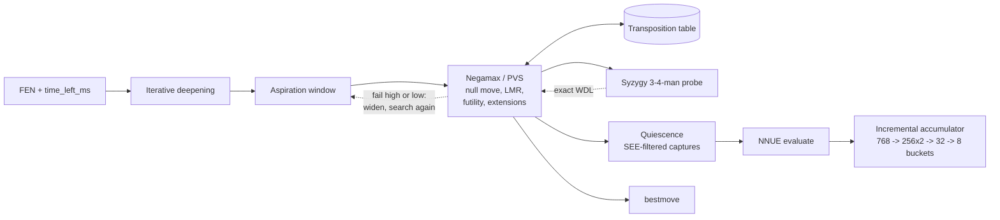

# NNUE Chess Engine
**Live at:** [talos.georgeputney.com](https://talos.georgeputney.com) - playable in the browser, no account needed

A chess engine written from scratch in Python, built for [AI Chessathon](https://aichessathon.com), a head-to-head competition run under a strict sandbox: one CPU core, 2 GB, no network, no GPU, 120 s + 0.5 s per move. Iterative deepening with aspiration windows drives a fail-soft negamax alpha-beta search with principal variation search, a transposition table, null-move and reverse futility pruning, late move reductions, and a quiescence search filtered by static exchange evaluation. Positions are scored by a dual-perspective NNUE trained from scratch on 215M Lichess positions, with a second net specialised for endgames and a Syzygy tablebase probe beneath both. The board, move generator and search are `numba`-jitted bitboards standing in for `python-chess`, warmed at import so compilation lands in the platform's init budget rather than the match clock. **Final result: 2314 Elo, 48th of 465 entries** - up from a 1498 start over 122 rated games (49W 23D 42L); see [`games/results.csv`](games/results.csv) for the record and [`games/`](games) for every PGN.

No third-party engine or network went into this. Every heuristic and every tuned weight traces to a measurement in this repo rather than a value copied from somewhere, which is what [`stages/`](stages) and [`bench/`](bench) are for.

## Search



## Structure

```
engine/                              # what the platform runs; the only directory it ever sees
├── agent.py                        # get_move(fen, time_left_ms), the search, the entry point
├── board.py                        # bitboard position, FEN parsing, make/unmake
├── movegen.py                      # legal move generation
├── attacks.py                      # magic bitboard attack tables
├── move.py                         # move encoding, SEE, move ordering scores
├── bitboard.py                     # popcount, lsb, and the bit twiddling underneath
├── zobrist.py                      # incremental position hashing
├── accumulator.py                  # NNUE feature transformer, updated incrementally
├── net.py                          # quantised weight loading, plain-numpy forward pass
├── arch.py                         # feature indexing and output-bucket definitions
├── net.npz, net_eg.npz             # the shipped nets: all-position, and <= 16 men
├── tables.py                       # Texel-tuned piece-square tables (classical eval)
├── tablebase.py                    # Syzygy 3-4-man WDL probe
├── syzygy/                         # the tablebase files themselves
└── reference.py                    # pure python-chess twin: fallback, and the golden reference

stages/                              # the development arc, each stage runnable and benchmarked
├── 01-material-1ply                # material counting, one ply
├── 02-alphabeta-quiescence         # alpha-beta with a quiescence search
├── 03-tt-pvs-history               # transposition table, PVS, history heuristic
├── 04-pesto-tapered                # tapered piece-square evaluation
├── 05-texel-tuned                  # weights fitted to game outcomes
├── 06-full-pruning                 # null move, futility, LMR, extensions
├── 07-numba-classical              # the numba bitboard rewrite
└── 08-single-nnue                  # the network replaces the hand-tuned evaluation

bench/                               # how every claim here was measured
├── openings_bench.py               # the Elo A/B, with a 95% confidence interval
├── nodebench.py                    # bit-identical node counts, for exact refactors
├── perft.py                        # move generation correctness against known counts
├── verify_*.py                     # numba path vs reference.py, function by function
├── eg_suite.py                     # endgame evaluation error against labelled positions
└── ab.py, ab_nnue.py               # head-to-head runners behind the Elo tests

tools/                               # the offline training pipeline, none of it shipped
├── ingest_lichess.py               # download and shard the training corpus
├── label.py, label_eg.py           # score positions to train against
├── model.py, train_nn.py           # torch NNUE training
├── export_nn.py                    # quantise and write net.npz
├── tune.py                         # Texel tuning of the classical weights
├── gen_magics.py                   # generate the magic bitboard constants
└── bundle_engine.py                # flatten engine/ into a submission zip

harness/                             # the competition's runner, referee and clock, vendored
lichess/                             # UCI bridge: the same engine on lichess, or in any GUI
web/                                 # the browser demo: one warm engine behind an HTTP server
docs/                                # plan.md, nnue-plan.md, writeup.md - the full build log
games/                               # 123 PGNs and results.csv from the rated games
```

## Requirements

Python 3.12+, and [uv](https://docs.astral.sh/uv/).

```bash
make setup                           # uv sync: numpy, numba, python-chess, torch (training only)
```

The engine itself imports only numpy, numba and python-chess. torch is needed for `tools/`.

## Usage

**Play and measure:**

```bash
# one full-length game, NNUE engine vs the classical build it replaced
make play

# 20 fast games of the same pairing, prints a score
make arena

# the Elo A/B with a 95% confidence interval - the test every change had to clear
make bench

# exact-refactor and numba-vs-reference correctness checks
make verify

# ruff, mypy strict, and a couple of games that have to finish cleanly
make gate
```

**Package for the competition platform:**

```bash
make zip                             # submission.zip, agent.py at the root
```

**Run it as something you can play:**

```bash
make web                             # browser demo on http://localhost:8000
make lichess-check                   # a scripted UCI session through the bridge
make lichess-config                  # fill this checkout's paths into a lichess-bot config
```

## Deployment

Two front ends call the same `get_move(fen, time_left_ms)` the competition platform called, and nothing under `engine/` changes for either.

[`web/`](web) is the browser demo - a small `http.server` holding one warm engine process, with the board, the clock and the legal moves all owned server-side so the page carries no chess logic. It plays 2+1 on its own clock. `web/Dockerfile` builds it; [`web/README.md`](web/README.md) covers hosting and the knobs that matter on one core.

[`lichess/`](lichess) is a UCI front end, so the engine plays on lichess through [lichess-bot](https://github.com/lichess-bot-devs/lichess-bot) or in any UCI GUI. The interesting part is the clock: `get_move` budgets a move as a fraction of whatever clock it is handed, fitted to one time control, so [`lichess/uci.py`](lichess/uci.py) converts lichess's many into an equivalent one rather than rewriting the budget. Setup in [`lichess/README.md`](lichess/README.md).

## Measured, stage by stage

[`stages/`](stages) is the development arc as runnable snapshots, each with its own README explaining what it added and the measurement that justified it. `docs/plan.md` and `docs/nnue-plan.md` are the full build log: every exact refactor checked bit-identical against [`bench/nodebench.py`](bench/nodebench.py), every heuristic change required to clear zero on [`bench/openings_bench.py`](bench/openings_bench.py)'s 95% confidence interval against the stage before it. [`docs/writeup.md`](docs/writeup.md) has the design notes, including what was tried and rejected - a lazy accumulator, a 5-man tablebase slice, and several endgame retrains all lost Elo and were reverted.

## Credits

`harness/` - the local runner, referee and clock that mirror the platform protocol - is the [AI Chessathon starter](https://github.com/advitrocks9/aichessathon-starter) by Advit Arora, used under the MIT License and never edited independently of it. [`PROVENANCE.md`](PROVENANCE.md) has the full file-by-file split; everything else is mine.

## Stack

Python, numpy, numba, python-chess, PyTorch, Syzygy tablebases, ruff, mypy, Docker
