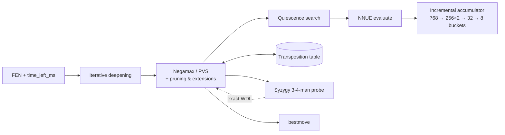

# A hand-rolled NNUE chess engine

A from-scratch chess engine — negamax, alpha-beta, a numba-compiled bitboard core, and a
self-trained NNUE evaluation — built for [AI Chessathon](https://aichessathon.com), a
head-to-head engine competition run under a strict sandbox: one CPU core, 2 GB, no network, no
GPU, 120 s + 0.5 s per move. **Final result: 2314 Elo, #48 of 465 entries (top 10%)** — up from
a 1498 starting rating over 122 rated games (49W 23D 42L, 53.1% score); see
[`docs/games.csv`](docs/games.csv) for the full record and [`docs/games/`](docs/games) for the
individual PGNs.

No third-party engine or network went into this. Every heuristic and every tuned weight traces
to a measurement in this repo, not a value copied from somewhere — that discipline, more than
any single technique, is what [`stages/`](stages) and [`docs/`](docs) below are for.

## Architecture



- **Search**: iterative deepening with aspiration windows; negamax alpha-beta with PVS
  (full window on the first move, null-window scout + re-search after); a transposition table;
  null-move pruning, reverse futility pruning, late move reductions/pruning, internal iterative
  reduction, check extensions, mate-distance pruning; quiescence search with delta pruning and
  SEE-filtered captures.
- **Evaluation**: a dual-perspective NNUE (768 → 256×2 feature transformer → a small tail with
  8 output buckets by piece count), trained on 215M Lichess positions, plus a
  Stockfish-mixed second net specialised for ≤ 16-man endgames — the all-position net alone
  rated a won rook-up ending at +72 cp, accurate for move-ranking but flat where the search
  needs a gradient to convert. A Syzygy 3-4-man tablebase probe backs both up in the endgame.
- **Runtime**: the board, move generator, and search are `numba`-jitted bitboards standing in
  for `python-chess`, warmed at import so JIT compilation lands in the platform's 90 s init
  budget rather than the match clock. `engine/reference.py` is the pure-`python-chess` twin
  this was ported from — the fallback `get_move` calls if numba fails to compile on the
  platform, and the golden reference `bench/verify_*.py` checks the compiled path against.

Full design notes, including what was tried and rejected, in
[`docs/writeup.md`](docs/writeup.md).

## The build, one measured stage at a time

[`stages/`](stages) is the actual development arc as runnable snapshots — material eval, then
alpha-beta, a transposition table, a tapered PST eval, Texel-tuned weights, the full classical
pruning suite, a numba rewrite, and finally NNUE — each with its own README explaining what it
added and the measurement that justified it. `docs/plan.md` and `docs/nnue-plan.md` are the
full build log: every exact refactor checked bit-identical against
[`bench/nodebench.py`](bench/nodebench.py), every heuristic change required to clear zero on
[`bench/openings_bench.py`](bench/openings_bench.py)'s 95% confidence interval against the
stage before it.

## Layout

```
engine/     the engine that played the competition - the only thing the platform actually runs
stages/     the development arc: 01-material-1ply ... 07-numba-classical, 08-nnue
bench/      how every claim here was measured, and how to reproduce it
tools/      the offline training pipeline (data, Texel tuning, NNUE training/export)
harness/    the competition's local runner/referee/clock, vendored, unmodified
docs/       the build log, the retrospective, and the real game record
```

## Running it

```
make setup          # uv sync
make play            # one full-length game, engine vs the classical build it replaced
make arena           # 20 fast games, same pairing, prints a score
make bench           # the Elo A/B, with a 95% confidence interval
make verify           # exact-refactor / numba-vs-reference correctness checks
make zip              # build submission.zip with agent.py at the root
make gate             # ruff, mypy strict, and a couple of games that have to finish cleanly
```

Anything the agent prints to stdout or stderr shows up in the harness output; the platform
discards it in rated games and shows it in the validation log.

## Credits

`harness/` — the local runner, referee, and clock that mirror the platform protocol — is the
[AI Chessathon starter](https://github.com/advitrocks9/aichessathon-starter) by Advit Arora,
used under the MIT License (see `LICENSE`), unmodified. Everything else is mine.
[`PROVENANCE.md`](PROVENANCE.md) has the full file-by-file split.

## The competition

The agent contract and the rules lived at
[aichessathon.com/docs](https://aichessathon.com/docs) — canonical while the competition ran,
subject to change, referenced here only as history now that it's over.
